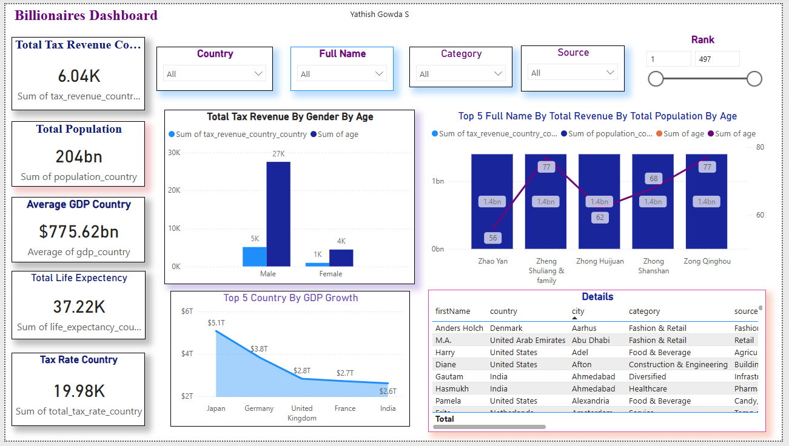

# 💰 Billionaires Dashboard (Power BI)

## 📌 Overview
Interactive Power BI dashboard built using a Billionaires dataset to analyze tax revenue, population, GDP growth, and demographic insights.

## 🎯 Aim
To create a professional and interactive dashboard for analyzing global billionaire data and economic patterns.

## ⚙️ Tools Used
- Power BI Desktop  
- Power Query  
- DAX  

## 🔄 Data Cleaning
- Replaced Gender values (M → Male, F → Female)  
- Removed `$` from Tax Revenue  
- Converted GDP Growth to integer  
- Fixed data types and handled null values  

## 📊 Dashboard

### 🔹 KPIs
- Total Tax Revenue  
- Total Population  
- Average GDP Growth  
- Total Life Expenditure  
- Total Tax Rate  

### 🔹 Slicers
- Country  
- Full Name  
- Category  
- Sources  
- Rank (Slider)  

### 🔹 Visuals
- Column Chart → Tax Revenue by Gender & Age  
- Bar Chart → Top 5 Billionaires by Revenue  
- Area Chart → Top 5 Countries by GDP Growth  
- Table → Detailed dataset view  

## 🎨 Features
- Dark professional theme  
- Fully interactive dashboard  
- Dynamic filtering across all visuals  

## 📸 Output

### Dashboard View

## 💡 Key Insights
- Majority of tax revenue comes from male billionaires  
- Technology category shows strong GDP growth impact  
- Wealth distribution varies significantly by age and country
